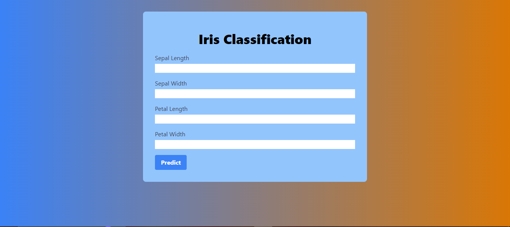

# Iris flower classification

Welcome to my project of machine learningr.

<div align="center">
  <br />
    <!-- <a href="https://mubashir-a.vercel.app" target="_blank"> -->
      
    <!-- </a> -->
  <br />

## About Me
I am Mubashir Ali, a passionate machine learner.


## Connect with Me
- **GitHub**: [mubashir1837](http://github.com/mubashir1837/)
- **LinkedIn**: [Mubashir Ali](https://linkedin.com/in/mubashirali3)

## How to Contribute
If you'd like to contribute in this flask app, you can follow these steps:

1. **Fork** the repository.
2. **Clone** the forked repository to your local machine:
    ```
    git clone https://github.com/mubashir1837/iris_classfication
    ```
3. Make your changes and enhancements.
4. **Run on local host** 'open terminal go to the directory and type python app.py then click on link http://127.0.0.1:5000'
 
4. **Commit** your changes:
    ```
    git commit -am 'Added feature XYZ'
    ```
5. **Push** to your forked repository:
    ```
    git push origin master
    ```
6. Finally, create a new **Pull Request** from your forked repository to the original repository.

Thank you for your contributions!
